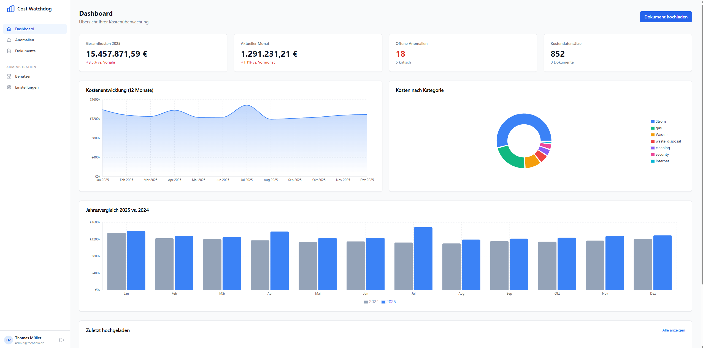

# Cost Watchdog

[](https://github.com/aliuyar1234/cost-watchdog/actions/workflows/ci.yml)
[](LICENSE)
[](.node-version)

Cost Watchdog is a self-hosted cost monitoring platform that ingests invoices (PDF/CSV/XLSX), extracts cost records, detects anomalies, and notifies teams before overspend becomes visible in month-end or yearly reviews.

> Status: early preview (`v0.1.0`). APIs, UX, and data model may change.

## Screenshot



## Key capabilities

- Document ingestion and validation (PDF, CSV, XLSX) with S3-compatible storage (MinIO for local development)
- Automated processing pipeline (upload → extraction → anomaly detection → alerting) using Redis + BullMQ workers
- Multiple notification channels: Email (Resend), Slack webhooks, Microsoft Teams webhooks
- Role-based access control and scoped API keys
- OpenAPI 3.1 spec + Swagger UI (`/api/v1/docs`)
- Security hardening: CSRF, rate limiting, secure logging/redaction, optional encrypted fields (AES-256-GCM), optional MFA (TOTP)

## Architecture


## Repository layout

```
apps/
  api/                Fastify API + workers (http://localhost:3001)
  web/                Next.js App Router UI (http://localhost:3000)
packages/
  core/               Shared domain types and utilities
  connectors/         Document connectors/parsers (PDF/CSV/XLSX)
  connector-sdk/      Connector SDK
  ui/                 Shared UI primitives (optional)
infrastructure/       Docker Compose files (dev/test/e2e)
scripts/              Repo automation (integration/e2e runners, load tests)
```

## Getting started (local development)

### Prerequisites

- Node.js 20+
- pnpm 8+
- Docker + Docker Compose

### 1) Install dependencies

```bash
pnpm install
```

### 2) Configure environment

```bash
cp .env.example .env
```

### 3) Start infrastructure

```bash
docker compose -f infrastructure/docker-compose.yml up -d
```

### 4) Start API and Web

```bash
pnpm --filter @cost-watchdog/api dev
pnpm --filter @cost-watchdog/web dev
```

Default URLs:

- Web: `http://localhost:3000`
- API: `http://localhost:3001/api/v1`
- Swagger UI: `http://localhost:3001/api/v1/docs`

## Configuration

Configuration is documented in `.env.example` (including security, digest, and retention options).

Common variables:

- `DATABASE_URL`, `REDIS_URL`
- `AUTH_SECRET` (required, 32+ chars)
- `S3_ENDPOINT`, `S3_BUCKET`, `S3_ACCESS_KEY`, `S3_SECRET_KEY`, `S3_REGION`
- `WEB_URL`, `NEXT_PUBLIC_API_URL`
- Optional: `FIELD_ENCRYPTION_KEY` (required for MFA and encrypted fields)
- Optional: `RESEND_API_KEY` for email alerts
- Optional: `ANTHROPIC_API_KEY` for LLM extraction fallback
- Optional: `METRICS_TOKEN` to protect `/metrics`

## Testing

```bash
pnpm lint
pnpm typecheck

# API integration tests (spins up Postgres + Redis via Docker)
pnpm test
pnpm test:integration

# E2E smoke tests (spins up infra + api + web via Docker)
pnpm test:e2e
```

## Load testing (k6)

See `scripts/loadtest/README.md`.

## Security

Please see `SECURITY.md` for reporting guidelines and hardening notes.

## Contributing

See `CONTRIBUTING.md` and `CODE_OF_CONDUCT.md`.

## License

MIT. See `LICENSE`.
