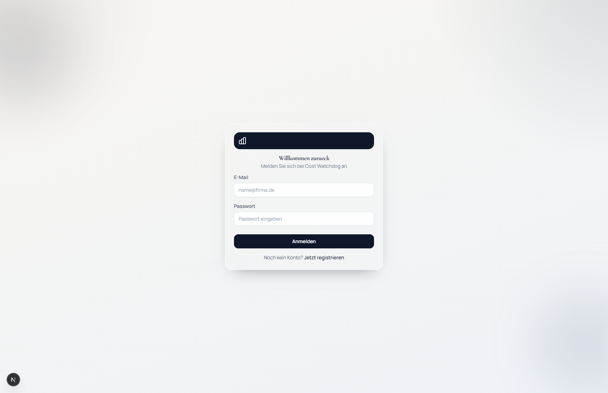
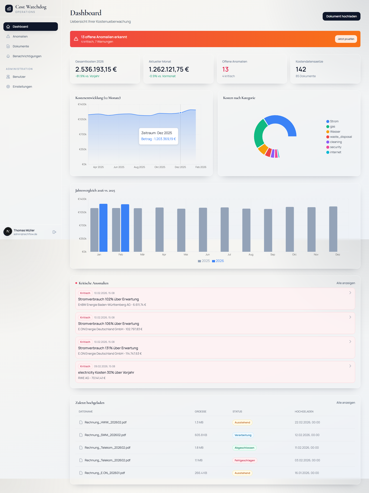
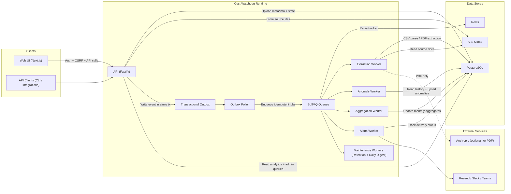

# Cost Watchdog

[](https://github.com/aliuyar1234/cost-watchdog/actions/workflows/ci.yml)
[](LICENSE)
[](.node-version)

Cost Watchdog is a self-hosted cost monitoring and anomaly detection platform.

It ingests cost data, runs automated anomaly checks, and delivers notifications before overspend becomes visible in monthly or yearly reporting.

> Status: preview (`v0.1.0`). APIs, UX, and data model are still evolving.

## Showcase



More screenshots: `docs/showcase/`

## What you get

- CSV-first ingestion with strong validation and structured extraction.
- Optional PDF ingestion through LLM extraction only (`ANTHROPIC_API_KEY` required).
- Processing pipeline (`upload -> extraction -> anomaly detection -> alerting`) via Redis + BullMQ workers.
- Analytics and exports backed by pre-aggregated monthly tables.
- Notification channels: email (Resend), Slack, and Microsoft Teams webhooks.
- Security baseline: HttpOnly auth cookies, CSRF protection, scoped API keys, rate limiting, audit logs, optional MFA, and secure logging redaction.

## Ingest policy

- Primary ingest format: `text/csv`
- Secondary format: `application/pdf` (only when `ANTHROPIC_API_KEY` is configured)
- Other spreadsheet/image formats are not accepted by upload routes.

## Architecture


```mermaid
flowchart LR
  subgraph Clients
    WEB["Web UI (Next.js)"]
    APIC["API Clients (CLI / Integrations)"]
  end

  subgraph Runtime["Cost Watchdog Runtime"]
    API["API (Fastify)"]
    OUTBOX["Transactional Outbox"]
    POLLER["Outbox Poller"]
    QUEUE["BullMQ Queues"]
    EXTRACT["Extraction Worker"]
    ANOM["Anomaly Worker"]
    AGGR["Aggregation Worker"]
    ALERT["Alerts Worker"]
    MAINT["Maintenance Workers (Retention + Daily Digest)"]
  end

  subgraph Data["Data Stores"]
    PG["PostgreSQL"]
    REDIS["Redis"]
    S3["S3 / MinIO"]
  end

  subgraph External["External Services"]
    LLM["Anthropic (optional for PDF)"]
    NOTIFY["Resend / Slack / Teams"]
  end

  WEB -->|"Auth + CSRF + API calls"| API
  APIC --> API

  API -->|"Upload metadata + state"| PG
  API -->|"Store source files"| S3
  API -->|"Write event in same tx"| OUTBOX

  OUTBOX --> POLLER
  POLLER -->|"Enqueue idempotent jobs"| QUEUE
  QUEUE -->|"Redis-backed"| REDIS

  QUEUE --> EXTRACT
  QUEUE --> ANOM
  QUEUE --> AGGR
  QUEUE --> ALERT
  QUEUE --> MAINT

  EXTRACT -->|"CSV parse / PDF extraction"| PG
  EXTRACT -->|"Read source docs"| S3
  EXTRACT -.->|"PDF only"| LLM

  ANOM -->|"Read history + upsert anomalies"| PG
  AGGR -->|"Update monthly aggregates"| PG
  ALERT -->|"Track delivery status"| PG
  ALERT --> NOTIFY

  API -->|"Read analytics + admin queries"| PG
```

Mermaid source: `docs/watchdog-architecture.mmd`

See `docs/architecture.md` for runtime flow and worker topology.

## Repository layout

```text
apps/
  api/                Fastify API + workers (default http://localhost:3001)
  web/                Next.js web app (default http://localhost:3000)
packages/
  core/               Shared domain types and anomaly engine
  connectors/         CSV and PDF extraction connectors
  connector-sdk/      Shared connector contracts
  ui/                 Shared UI primitives
infrastructure/       Docker Compose and deployment manifests
scripts/              Integration/e2e runners and utility scripts
docs/                 Technical documentation
```

## Getting started (local)

### Prerequisites

- Node.js 20+
- pnpm 8+
- Docker + Docker Compose

### 1) Install dependencies

```bash
pnpm install
```

### 2) Configure environment

```bash
cp .env.example .env
```

### 3) Start infrastructure

```bash
docker compose -f infrastructure/docker-compose.yml up -d
```

### 4) Initialize database schema

```bash
pnpm db:push
```

### 5) Start API + workers

```bash
pnpm --filter @cost-watchdog/api dev
pnpm --filter @cost-watchdog/api dev:workers
```

### 6) Start web app

```bash
pnpm --filter @cost-watchdog/web dev
```

Default URLs:

- Web: `http://localhost:3000`
- API: `http://localhost:3001/api/v1`
- Health: `http://localhost:3001/health`
- OpenAPI docs: `http://localhost:3001/api/v1/docs` (disabled by default in production)

## Configuration highlights

See `.env.example` for the full list.

Required for a working local stack:

- `DATABASE_URL`
- `REDIS_URL`
- `AUTH_SECRET` (32+ chars)
- `S3_ENDPOINT`, `S3_BUCKET`, `S3_ACCESS_KEY`, `S3_SECRET_KEY`, `S3_REGION`
- `WEB_URL`, `NEXT_PUBLIC_API_URL`

Important optional settings:

- `ANTHROPIC_API_KEY` for PDF ingestion/extraction
- `RESEND_API_KEY` for email alerts
- `METRICS_TOKEN` for protecting `/metrics` (required in production)
- `OPENAPI_DOCS_ENABLED` to expose docs/spec routes in production

## Demo data

```bash
pnpm demo:seed
pnpm demo:check
```

## Quality checks

```bash
pnpm lint
pnpm typecheck
pnpm test
pnpm test:e2e
```

## Deployment

Build images:

```bash
docker build -f apps/api/Dockerfile -t cost-watchdog-api .
docker build -f apps/web/Dockerfile -t cost-watchdog-web .
```

Deployment examples:

- `infrastructure/docker-compose.prod.yml`
- `infrastructure/docker-compose.swarm.yml`
- `infrastructure/docker-compose.observability.yml`

## Documentation

- `docs/architecture.md`
- `docs/api-design.md`
- `docs/data-model.md`
- `docs/anomaly-engine.md`
- `docs/tech-stack.md`
- `docs/SECURITY.md`

## Security

Please see `SECURITY.md` for reporting policy and `docs/SECURITY.md` for implemented controls.

## Contributing

See `CONTRIBUTING.md` and `CODE_OF_CONDUCT.md`.

## License

MIT. See `LICENSE`.
